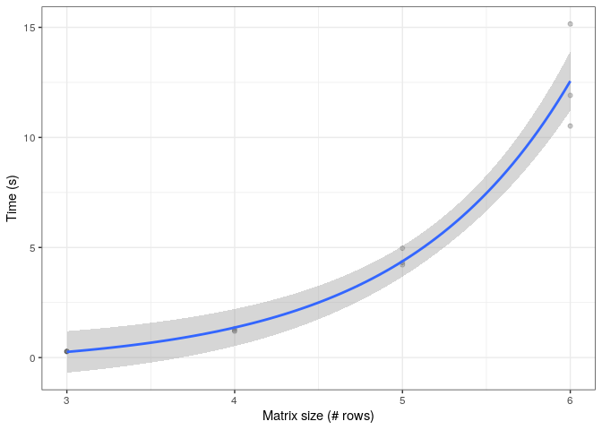

Benchmark for Word game solver
================

# Runtime for one matrix

Time take to run for a 6 x 6 matrix: 4.727 s.

# Runtime for different matrix sizes

``` r
ggplot2::ggplot(time_to_solve, aes(matrix_size, time)) +
  geom_point(alpha = 0.2) +
  geom_smooth(method = "lm", formula = "(y ~ exp(x))") +
  ylab("Time (s)") +
  xlab("Matrix size (# rows)") +
  theme_bw()
```

<!-- -->

# Appendix

Git hash: e99e0de9849b820c4a6acff3efad8573656f854d

Git commit date: Sun Jun 7 14:17:10 2020 +0100

Repository: wordgamesolver
